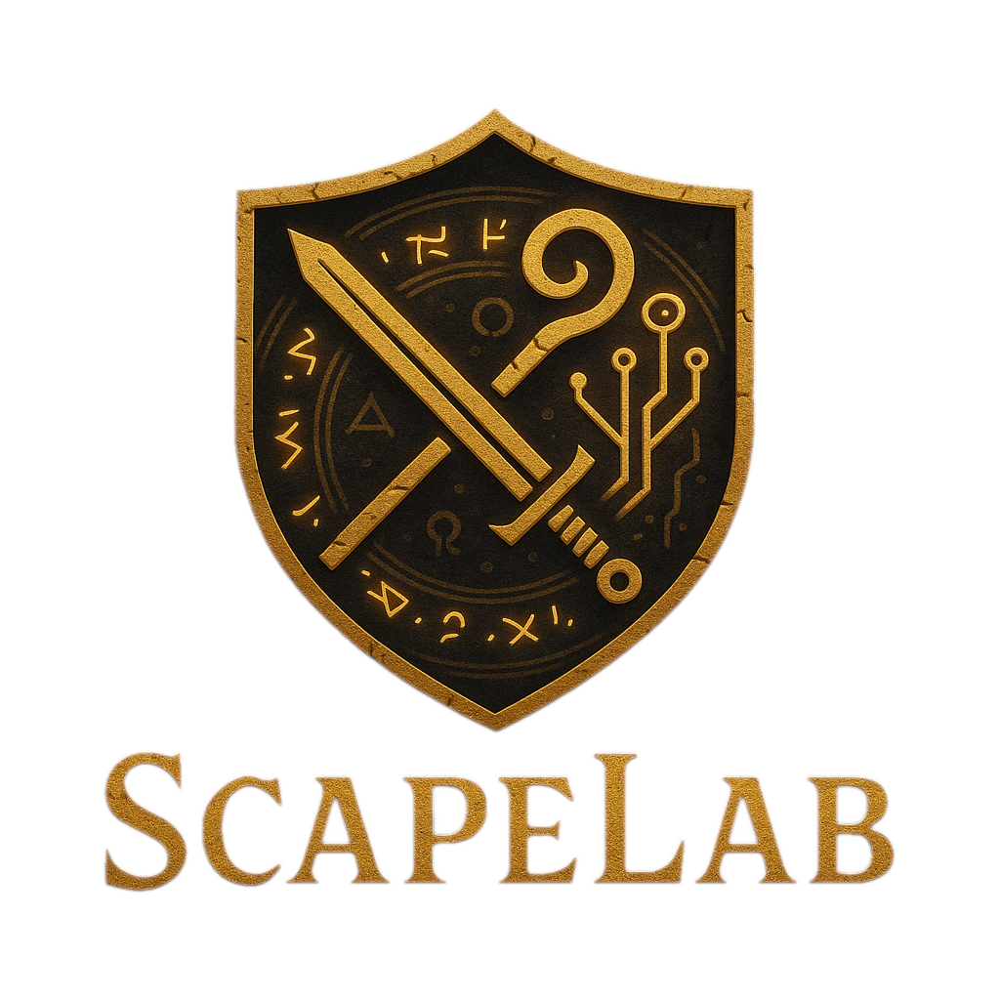

ScapeLab DPS Calculator



A comprehensive damage-per-second calculator for Old School RuneScape with accurate combat formulas, equipment comparison, and boss statistics.


Overview

    If you encounter a bug or have a suggestion, submit it from the [Report Bug](/report-bug) page. Reports are automatically converted into GitHub issues via a workflow.
The ScapeLab DPS Calculator is a powerful tool for Old School RuneScape players to optimize their combat gear and strategies. By accurately implementing the game's combat formulas, this calculator helps players compare different equipment setups, account for special effects, and calculate expected damage against various npcs.
Key Features

    All Combat Styles: Full support for Melee, Ranged, and Magic calculations
    Equipment Database: Comprehensive database of in-game items with their stats and effects
    Npc Encyclopedia: Detailed information for all npcs including their defensive stats and weaknesses
    Special Effects: Support for passive effects, set effects, and monster-specific bonuses
    Defense Reduction: Calculate the impact of defense-lowering special attacks
    Visualizations: Save loadouts and view DPS, max hit and hit chance graphs
    Passive Effects: Automatic detection of relevant passive effects for your setup
    Prayer & Potions: Account for all combat boosting prayers and potions

🚀 Getting Started
Prerequisites

    Node.js 18.x LTS
    Python 3.8+
    npm or yarn
    pip

Installation
Frontend Setup

bash

# Clone the repository
git clone https://github.com/QualitySushi/osrs-simulator.git
cd osrs-simulator

# Install dependencies
npm install

# Run development server
npm run dev

The frontend will be available at http://localhost:3000
Backend Setup

bash

# Navigate to backend directory
cd backend

# Create virtual environment
python -m venv venv
source venv/bin/activate  # On Windows: venv\Scripts\activate

# Install dependencies
pip install -r requirements.txt

The backend relies on `aioodbc` for asynchronous SQL Server access. Ensure the
system has the Microsoft ODBC driver installed.

# Run development server
uvicorn app.main:app --reload

The API will be available at http://localhost:8000
📚 Documentation
Usage Guide

    Select Combat Style: Choose between Melee, Ranged, or Magic
    Set Your Stats: Enter your combat levels and boosts
    Choose Equipment: Select gear for each slot
    Select Target: Pick a npc or enter custom defense stats
    Apply Modifiers: Select prayers, potions, and special attacks
    Calculate: View your expected DPS and other stats
    Compare: Save setups to compare different loadouts
    Special Attack DPS: Specify a special weapon, energy cost, and regeneration rate to see how much extra damage specials add alongside your mainhand. Specials fire automatically whenever your energy is at least the listed cost. Energy regenerates by default at **10% every 30 seconds**, doubled if a Lightbearer ring is equipped and multiplied by **1.5** while under a surge potion. `special_attack_speed` controls how quickly special hits occur compared to your normal `attack_speed`. Together with `special_energy_cost` and the fight `duration`, these values determine how many specials are used. A future `initial_special_energy` field may allow starting below 100% energy.

Additional documentation can be found in the `docs/` folder:

    docs/ARCHITECTURE.md - High level component diagram
    docs/WIREFRAME.md    - Basic UI wireframe
    docs/BEST_IN_SLOT_FINDER.md - How the BIS algorithm works

Technical Documentation
Frontend Architecture

The frontend is built with Next.js and uses:

    Zustand for state management
    TanStack Query for data fetching
    shadcn/ui and Tailwind CSS for styling
    TypeScript for type safety

State Persistence

The calculator remembers your last selected npc, locked gear, and loadout across
page reloads using Zustand's `persist` middleware. Npc and item lists are cached
locally for 12 hours so returning to the app doesn't require refetching all
reference data.

Backend Architecture

The backend is built with FastAPI and uses:

    Azure SQL Database for persistent storage
    Pydantic for data validation
    Custom calculators for combat style-specific logic
    Data scrapers for maintaining up-to-date game information

Combat Formulas

The calculator implements the following OSRS combat formulas:

Melee:

Effective Strength = floor((Strength Level × Prayer Bonus) + Style Bonus + 8)
Max Hit = floor(0.5 + Effective Strength × (Strength Bonus + 64) / 640)

Ranged:

Effective Ranged = floor((Ranged Level × Prayer Bonus) + Style Bonus + 8)
Max Hit = floor(0.5 + Effective Ranged × (Ranged Strength + 64) / 640)

Magic:

Effective Magic = floor((Magic Level × Prayer Bonus) + Style Bonus + 8)
Max Hit = floor(Base Spell Hit × (1 + Magic Damage Bonus))

Hit Chance:

If Attack Roll > Defence Roll:
  Hit Chance = 1 - (Defence Roll + 2) / (2 × (Attack Roll + 1))
Else:
  Hit Chance = Attack Roll / (2 × (Defence Roll + 1))

DPS:

DPS = Hit Chance × ((Max Hit + 1) / 2) / Attack Speed

⚙️ Configuration
Environment Variables

Create a `.env.local` file inside the `frontend` directory:

```bash
cd frontend
echo "NEXT_PUBLIC_API_URL=http://localhost:8000" > .env.local
```

For production, set this to your deployed API URL. The deployment workflows
expect a repository secret named `BACKEND_URL` which will be exposed as
`NEXT_PUBLIC_API_URL` during the frontend build.
GitHub Actions injects this value in `.github/workflows/azure-static-web-apps-yellow-stone-0daf36a0f.yml`.
Ensure this secret contains the URL of your deployed FastAPI service, for example
`https://scapelab-api-dvawaebtdze3brf0.canadacentral-01.azurewebsites.net`.

Set `NEXT_PUBLIC_FORCE_CLEAR_CACHE=true` in the same `.env.local` file if you
need to force users' browsers to clear all cached state on load. This is handy
when testers have visited a broken build and you want to wipe any persisted
data such as local storage.

When deploying the frontend, the workflow also requires a secret named
`AZURE_STATIC_WEB_APPS_API_TOKEN_YELLOW_STONE_0DAF36A0F` containing the
deployment token for your Azure Static Web App.
Database Setup

The backend now connects directly to an Azure SQL Database. Configure the
connection string using the `SQLAZURECONNSTR_DefaultConnection` environment
variable or provide the individual parameters:

    AZURE_SQL_SERVER
    AZURE_SQL_DATABASE
    AZURE_SQL_USERNAME
    AZURE_SQL_PASSWORD

When running in Azure App Service you can omit the username and password and
authenticate via Managed Identity.

The scraper utilities produce two SQLite databases: `osrs_all_items.db` and
`osrs_npcs.db`. The latter also includes an `npc_forms` table for multi-form
NPCs. Use `webscraper/runescape-items/migrate_sql_to_azure.py` to import this
data into the Azure SQL instance. The migration script now drops any existing
tables before recreating them, so it can be rerun safely. Item and NPC IDs are
copied from the SQLite sources to keep their ordering consistent across runs,
and the items table enforces `UNIQUE(name)` to guard against accidental
duplicates.

The API also caches npc and item lookups in memory. Set the
`CACHE_TTL_SECONDS` environment variable to control how long (in seconds)
these results remain cached. The default is `3600` seconds. On the first
request the server loads and caches the full npc and item lists, and all
subsequent search requests are served from this in-memory cache so the
database is only queried when a specific record is requested.

Database connections are created on demand. Control connection behaviour with
the following environment variables:

- `DB_CONNECTION_TIMEOUT` – Connection timeout in seconds (default `30`).
- `DB_MAX_RETRIES` – Number of connection retries for transient failures
  (default `3`).

The async database layer uses `aioodbc`, so the appropriate ODBC driver must be
installed on the host system. Ensure these environment variables are set before
starting the API so the database connection can be established successfully.

🔄 API Reference
Calculate DPS

POST /calculate/dps

Request Body:

json

{
  "combat_style": "melee",
  "strength_level": 99,
  "attack_level": 99,
  "attack_style_bonus_strength": 3,
  "melee_strength_bonus": 100,
  "melee_attack_bonus": 100,
  "attack_speed": 2.4,
  "target_defence_level": 100,
  "target_defence_bonus": 50
}

Include these optional fields to simulate special attacks:
```
"special_damage_multiplier": 1.2,
"special_accuracy_modifier": 1.0,
"special_attack_speed": 3.0,
"special_energy_cost": 50,
"special_regen_rate": 0.33
```

Special energy regenerates at **10% every 30 seconds** by default. This rate is
doubled when wearing the Lightbearer ring and increased by **50%** while a surge
potion is active. Instead of simulating a fixed duration, the calculator now
computes the average damage of a single hit and factors in special attack
regeneration mathematically. For example, a weapon that costs 25% special energy
can fire four specials every five minutes. Each special uses
`special_attack_speed` for its swing timer and the remaining time is filled with
regular attacks using `attack_speed`.

Response:

json

{
  "dps": 8.25,
  "max_hit": 47,
  "hit_chance": 0.84,
  "attack_roll": 16728,
  "defence_roll": 10920,
  "average_hit": 19.8,
  "effective_str": 110,
  "effective_atk": 107
}

Calculate Item Effect

POST /calculate/item-effect

Request Body:

```json
{
  "weapon_name": "Twisted bow",
  "target_magic_level": 200
}
```

Response:

```json
{
  "accuracy_multiplier": 1.299,
  "damage_multiplier": 1.919,
  "effect_description": "Twisted Bow vs 200 magic: +29.9% accuracy, +91.9% damage"
}
```

Import Seed
------------

POST `/import-seed`

Request Body:

```json
{
  "seed": "base64encodedstring"
}
```

Calculate DPS from Seed
-----------------------

POST `/calculate/seed`

Request Body:

```json
{
  "seed": "base64encodedstring"
}
```

Best In Slot
------------

POST `/bis`

Request Body: `DpsParameters`

Response: A mapping of gear slot to item details.

List Npcs
-----------

GET `/npcs`

GET `/npc/form/{form_id}` - Retrieve npc details by form identifier

Query Parameters:

- `page` – Page number (default `1`)
- `page_size` – Results per page (default `50`)

Search Endpoints
----------------

GET `/search/npcs` - Search for npcs by name
GET `/search/items` - Search for items by name

Query Parameters:

- `query` – Search term (required)
- `limit` – Maximum results to return. If omitted, all matches are returned.

List Items
----------

GET `/items`

Query Parameters:

- `combat_only` – Only items with combat stats (default `true`)
- `tradeable_only` – Only tradeable items (default `false`)
- `page` – Page number (default `1`)
- `page_size` – Results per page (default `50`)

Performance & API Best Practices
-------------------------------

- Use `page` and `page_size` on `/items` and `/npcs` to paginate responses and minimize payload size.
- Item and npc detail endpoints utilise server-side in-memory caches. Responses include a `Cache-Control` header with a `max-age` matching the `CACHE_TTL_SECONDS` setting.
- Adjust cache duration via the `CACHE_TTL_SECONDS` environment variable when launching the backend.

See the API documentation at /docs for more endpoints.
📊 Data Sources

All game data is sourced from the Old School RuneScape Wiki using custom data scrapers. The scraping tools are included in the repository:

    osrs_item_scraper.py: Scrapes equipment data
    extract.py: Scrapes npc data

🛠️ Contributing

Contributions are welcome! Please follow these steps:

    Fork the repository
    Create a feature branch: git checkout -b feature/amazing-feature
    Commit your changes: git commit -m 'Add amazing feature'
    Push to the branch: git push origin feature/amazing-feature
    Open a Pull Request
    If you encounter a bug or have a suggestion, submit it from the [Report Bug](/report-bug) page. Reports are automatically converted into GitHub issues via a workflow.

For major changes, please open an issue first to discuss what you would like to change.
Development Guidelines

    Follow the existing code style and architecture
    Add appropriate TypeScript types for new features
    Write tests for backend calculations
    Document any complex logic or formulas
    Update the README for significant changes

🔒 License

This project is licensed under the MIT License - see the LICENSE file for details.
👏 Acknowledgements

    Old School RuneScape Wiki for game data
    Jagex for creating Old School RuneScape
    The OSRS community for verifying formulas and mechanics

ScapeLab is not affiliated with Jagex Ltd. Old School RuneScape and Jagex are trademarks of Jagex Ltd.
