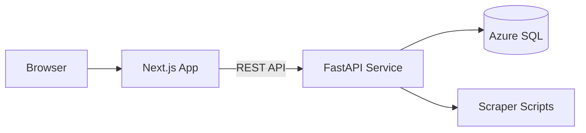

# Architecture Overview

This document illustrates the high level layout of the project and the flow between components.

## Component Diagram

* **Frontend** – Next.js application housed in `frontend/`.
* **Backend** – FastAPI service inside `backend/` that provides calculation endpoints.
* **Database** – Azure SQL database populated via scraper imports.
* **Webscraper** – Python scripts under `backend/webscraper` used to refresh game data.

## Data Flow

1. Users interact with the React frontend.
2. The frontend communicates with the FastAPI backend.
3. The backend queries the Azure SQL database and performs DPS calculations.
4. Results are returned to the frontend for display.

For more information see `docs/DEVELOPER_GUIDE.md`.
