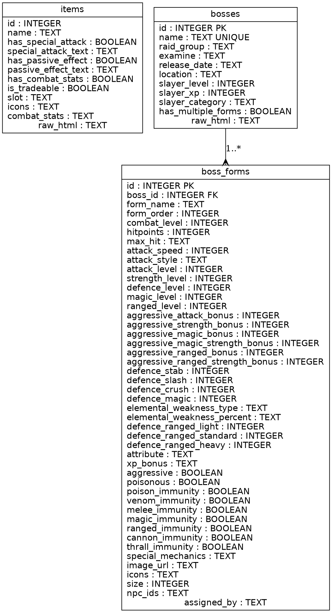

# Developer Guide

This document provides an overview of the codebase with additional diagrams to aid contributors.

## Overview

The project is split into three main parts:

1. **backend** – A FastAPI application providing DPS calculations and data APIs.
2. **frontend** – A Next.js application that consumes the API and provides the user interface.

Additional documentation lives inside the `docs` folder.

## Database Schema

The backend stores scraped game data in SQLite databases. An Entity Relationship Diagram (ERD) can be generated from the `database_schema.dot` file using Graphviz:

```bash
dot -Tpng docs/database_schema.dot -o database_schema.png
```

The resulting diagram shows the relationships between the tables:



- `items` holds equipment data and stats.
- `bosses` stores metadata for each boss.
- `boss_forms` stores individual forms or phases for bosses and references `bosses` via `boss_id`.

## Application Layers

- **Calculators** (`backend/app/calculators`) contain the core algorithms for melee, ranged and magic DPS.
- **Services** (`backend/app/services`) provide thin wrappers used by the FastAPI endpoints.
- **Repositories** (`backend/app/repositories`) interact with the database layer using `database.py`.
- **Webscraper** (`backend/webscraper`) contains scripts that populate the SQLite databases from the Old School RuneScape Wiki.

The separation allows the same calculation logic to be reused across the application.

## Testing

Unit tests live under `backend/app/testing`. Run them with:

```bash
python -m unittest discover backend/app/testing
```

## Frontend Structure

The React frontend is found in `frontend/src` and relies on:

- **Zustand** for state management (`store/`).
- **TanStack Query** for data fetching (`services/`).
- **shadcn/ui** components styled with Tailwind CSS.

## About Page

A simple about page exists at `frontend/src/app/about/page.tsx` and describes the project, its data sources and technologies used. It links back to the main calculator page.

## API Pagination

The `/items` and `/bosses` endpoints accept optional `page` and `page_size` query parameters. These correspond to SQL `OFFSET`/`FETCH` clauses in the database service.

- `page` defaults to `1`.
- `page_size` defaults to `50`.

### Caching

Item and boss detail lookups are cached using `cachetools.TTLCache`.
The cache duration is controlled by the `CACHE_TTL_SECONDS` environment
variable defined in `backend/app/config/settings.py`.

To override the default 3600‑second TTL during development run:

```bash
export CACHE_TTL_SECONDS=600  # 10 minutes
uvicorn app.main:app --reload
```

Caches automatically expire when the TTL elapses.

