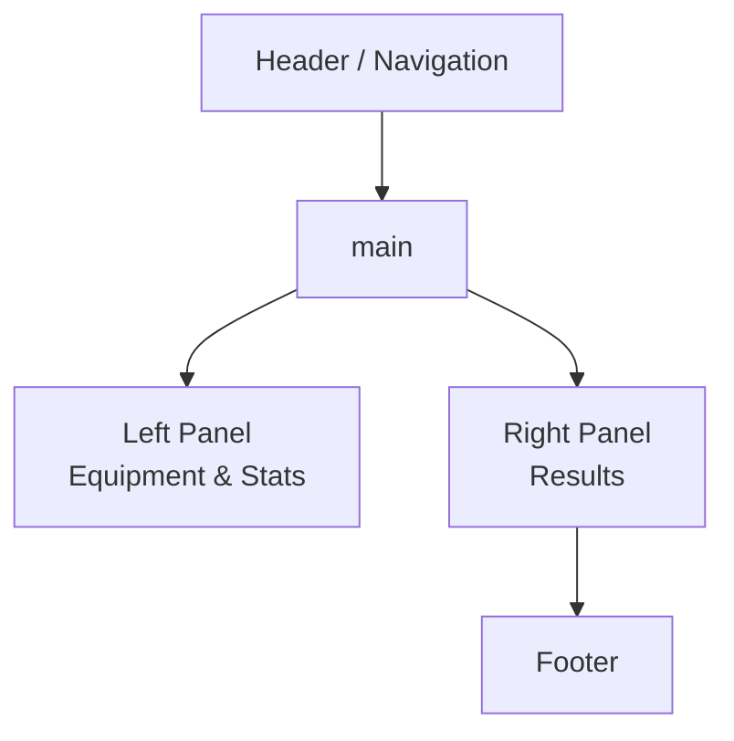

# UI Wireframe

The following diagram sketches the layout of the main calculator page.

* **Header** – contains navigation links and project title.
* **Left Panel** – forms for selecting equipment, combat style and boss.
* **Right Panel** – displays max hit, hit chance and DPS graphs.
* **Footer** – credits and external links.

This wireframe is a general guide; actual components live under `frontend/src`.
